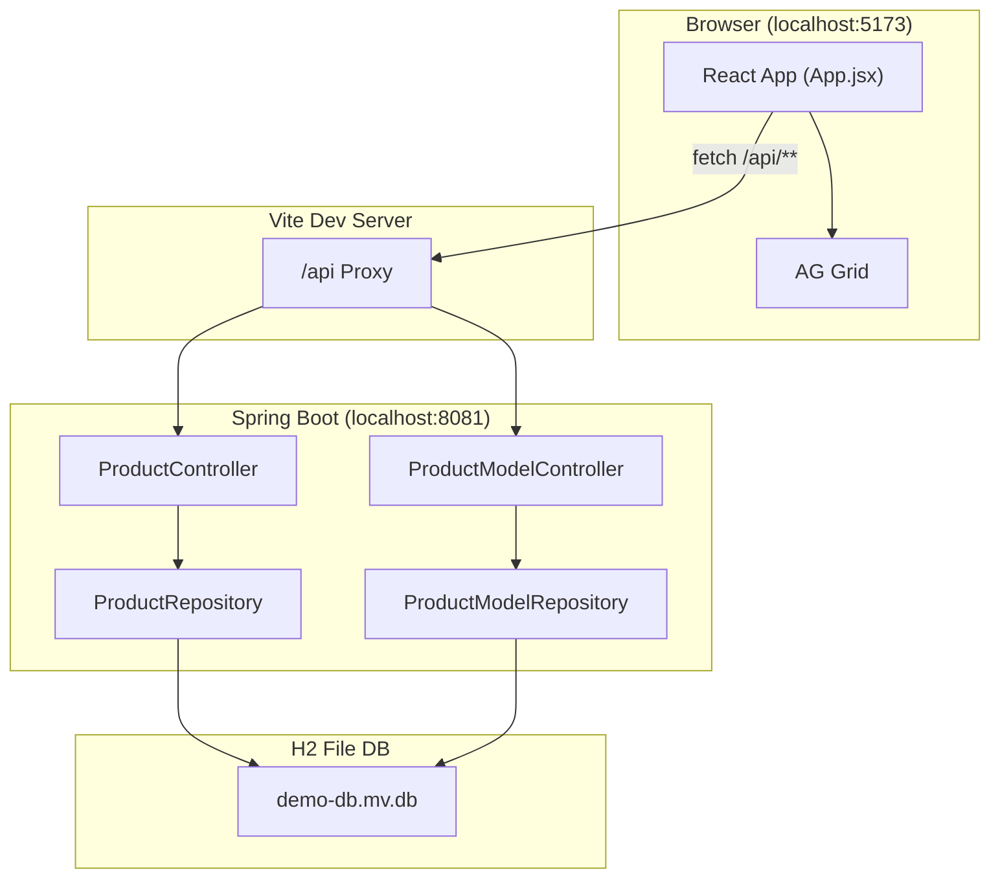
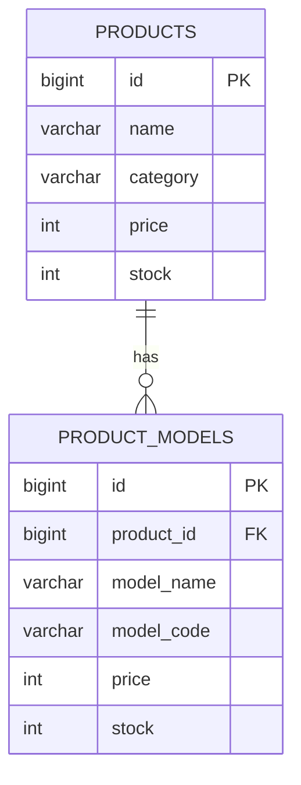
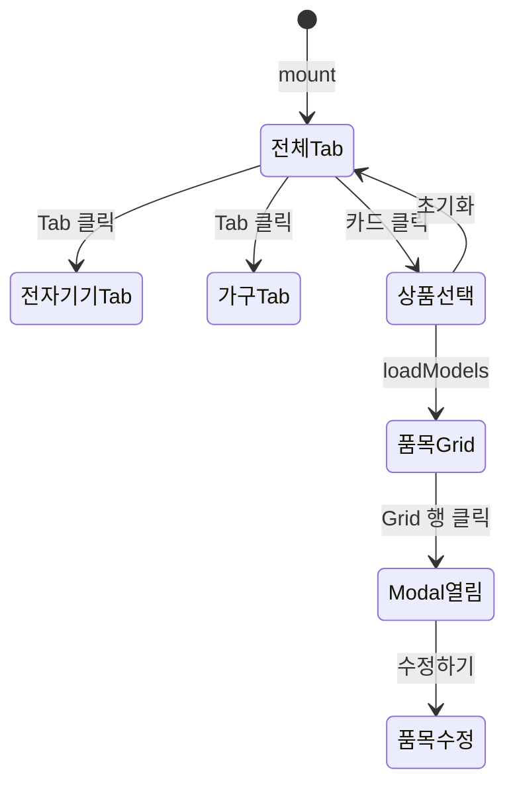
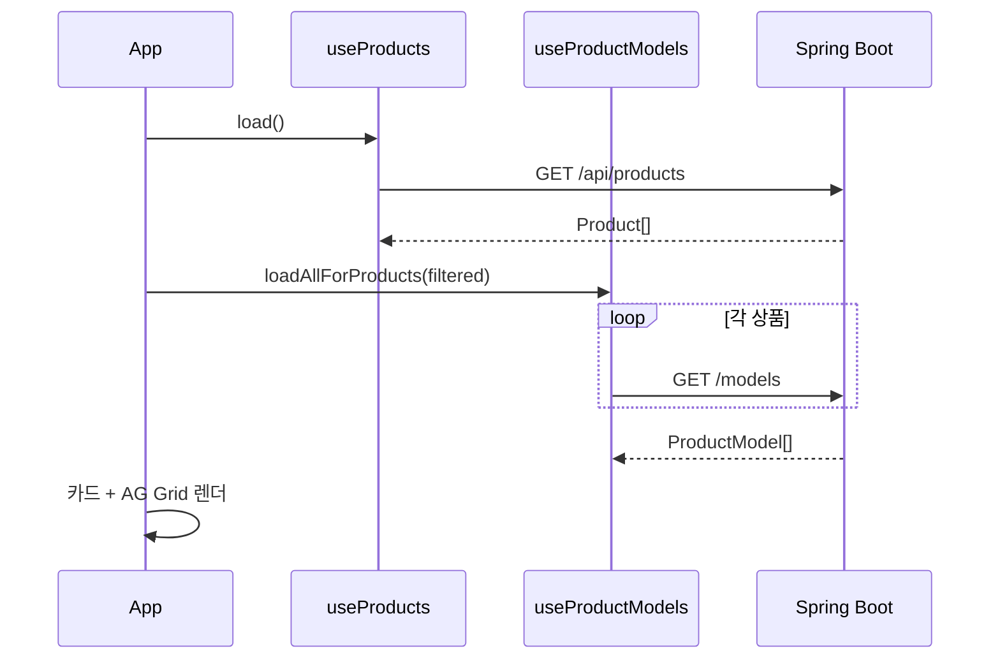
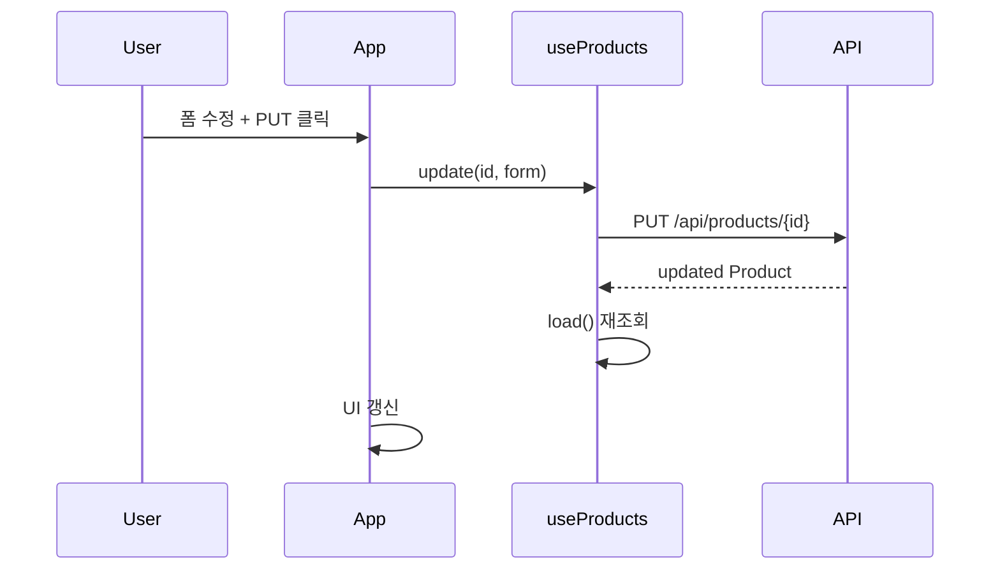
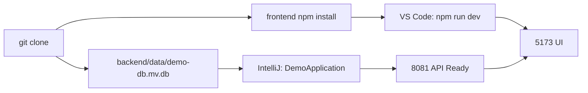

# 프로젝트 구조 상세

Spring Boot 3 + React 18 풀스택 **상품·품목 관리** 데모의 아키텍처·디렉터리·데이터·API를 상세히 설명합니다.

> 작업 가이드: [BACKEND_작업지시서.md](./BACKEND_작업지시서.md) · [FRONTEND_작업지시서.md](./FRONTEND_작업지시서.md)

---

## 1. 프로젝트 목적

| 목표 | 설명 |
|------|------|
| **REST API CRUD** | 상품·품목 Create/Read/Update/Delete |
| **풀스택 연습** | Spring Boot + React + H2 + AG Grid |
| **IDE별 실행** | Backend → IntelliJ, Frontend → VS Code |
| **DB 공유** | H2 파일(`demo-db.mv.db`) Git 포함 → clone 후 즉시 사용 |

---

## 2. 전체 아키텍처



### 2.1 기술 스택

| 구분 | 기술 | 버전/비고 |
|------|------|-----------|
| Frontend | React, JavaScript, Vite | 18, 5 |
| UI Grid | AG Grid Community | ag-grid-react |
| Backend | Spring Boot, Spring Data JPA | 3.2.5 |
| Language | Java | 17 |
| DB | H2 (file mode) | embedded |
| Build | Maven, npm | — |

### 2.2 포트·URL

| 서비스 | URL |
|--------|-----|
| Frontend UI | http://localhost:5173 |
| Backend API | http://localhost:8081/api/products |
| H2 Console | http://localhost:8081/h2-console |
| Vite Proxy | `/api/*` → `8081/api/*` |

---

## 3. 저장소 디렉터리 구조

```
react_test_001/
├── README.md                      # 프로젝트 소개·실행
├── PROJECT_구조_상세.md             # ★ 본 문서
├── BACKEND_작업지시서.md            # Backend 개발 가이드
├── FRONTEND_작업지시서.md           # Frontend 개발 가이드
├── PROJECT_STRUCTURE.md           # 구조 요약
├── PROJECT_GUIDE.md               # 종합 학습 가이드
├── FRONTEND_STRUCTURE.md          # Frontend 요약
├── react-demo.code-workspace      # VS Code 멀티루트
│
├── backend/                       # ★ IntelliJ에서 Open
│   ├── README.md
│   ├── pom.xml
│   ├── data/
│   │   └── demo-db.mv.db          # H2 DB (Git 포함)
│   ├── scripts/
│   │   └── export-db-snapshot.mjs
│   ├── .idea/                     # IntelliJ Run Config
│   └── src/main/
│       ├── java/com/example/demo/
│       └── resources/
│           ├── application.yml
│           └── db/
│
└── frontend/                      # ★ VS Code에서 Open
    ├── README.md
    ├── package.json
    ├── vite.config.js
    ├── .vscode/
    └── src/
```

---

## 4. Backend 상세

### 4.1 패키지 구조

```
com.example.demo
├── DemoApplication.java           # Spring Boot main
├── config
│   ├── WebConfig.java             # CORS: localhost:5173
│   └── ProductModelDataInitializer.java
└── product
    ├── Product.java               # Entity → products
    ├── ProductModel.java          # Entity → product_models
    ├── ProductRepository.java
    ├── ProductModelRepository.java
    ├── ProductController.java
    └── ProductModelController.java
```

### 4.2 레이어 책임

| 레이어 | 클래스 | 책임 |
|--------|--------|------|
| **Presentation** | `*Controller` | HTTP ↔ JSON, URL 매핑, 404 처리 |
| **Domain/Entity** | `Product`, `ProductModel` | 비즈니스 데이터, JPA 매핑 |
| **Persistence** | `*Repository` | DB CRUD, JPQL/Query Method |
| **Config** | `WebConfig`, `Initializer` | 횡단 관심사 |

### 4.3 Entity 관계



- **1:N** — 상품 1개 : 품목 N개
- `ProductModel.product` → `@ManyToOne`, JSON 응답에는 `productId`만 노출 (`@JsonIgnore`)

### 4.4 REST API 전체

#### 상품 API

```
GET    /api/products
GET    /api/products/{id}
POST   /api/products
PUT    /api/products/{id}
DELETE /api/products/{id}     ← 연결 품목도 삭제
```

#### 품목 API

```
GET    /api/products/{productId}/models
GET    /api/products/{productId}/models/{id}
POST   /api/products/{productId}/models
PUT    /api/products/{productId}/models/{id}
DELETE /api/products/{productId}/models/{id}
```

### 4.5 application.yml 핵심

| 설정 | 값 | 설명 |
|------|-----|------|
| `server.port` | 8081 | API 포트 |
| `datasource.url` | `jdbc:h2:file:./data/demo-db` | 파일 DB |
| `jpa.hibernate.ddl-auto` | update | Entity 변경 시 스키마 자동 갱신 |
| `sql.init.mode` | never | Git DB 파일 사용, 시드 SQL 미실행 |

### 4.6 DB 파일·스냅샷

| 파일 | 용도 |
|------|------|
| `data/demo-db.mv.db` | **실행용 H2 DB** (pull 후 바로 연결) |
| `db/data-snapshot.sql` | SQL 백업·복원 |
| `db/data-snapshot.json` | JSON 백업 |
| `db/data.sql` | (참고) 최초 시드 5상품 |
| `db/data-models.sql` | (참고) 최초 시드 25품목 |

---

## 5. Frontend 상세

### 5.1 src/ 구조

```
src/
├── main.jsx              # createRoot → <App />
├── App.jsx               # 상태·핸들러·JSX 조합
├── api.js                # fetch 래퍼 + productsApi + productModelsApi
├── index.css             # 전역·Tab·카드·Grid·Modal 스타일
├── hooks/
│   ├── useProducts.js    # 상품 list/get/create/update/delete
│   └── useProductModels.js  # load, loadAllForProducts, CRUD
├── utils/
│   ├── productForm.js    # emptyProductForm, toProductForm
│   └── modelForm.js      # emptyModelForm, toModelForm
└── components/
    ├── ProductCardGrid.jsx    # Tab 필터 → 5열 카드
    ├── ProductModelGrid.jsx   # AG Grid
    ├── ModelDetailModal.jsx   # overlay Modal
    └── ToggleSwitch.jsx       # 필터 UI
```

### 5.2 App.jsx 상태 다이어그램



### 5.3 Hook ↔ API 매핑

| Hook 함수 | HTTP | URL |
|-----------|------|-----|
| `useProducts.load` | GET | `/api/products` |
| `useProducts.getById` | GET | `/api/products/{id}` |
| `useProducts.create` | POST | `/api/products` |
| `useProducts.update` | PUT | `/api/products/{id}` |
| `useProducts.remove` | DELETE | `/api/products/{id}` |
| `useProductModels.load` | GET | `/api/products/{pid}/models` |
| `useProductModels.loadAllForProducts` | GET × N | 각 상품별 models |
| `useProductModels.getById` | GET | `.../models/{id}` |

### 5.4 vite.config.js

```typescript
server: {
  port: 5173,
  proxy: {
    '/api': { target: 'http://localhost:8081', changeOrigin: true }
  }
}
```

브라우저는 `fetch('/api/products')` → Vite가 8081로 중계 → CORS 문제 회피.

### 5.5 UI 컴포넌트 상세

| 컴ponent | 입력 (Props) | 출력/동작 |
|----------|-------------|-----------|
| **ProductCardGrid** | products, loading, activeCategory | 카드 클릭 → onSelect |
| **ProductModelGrid** | models, title, showProductColumn | 행 클릭 → onSelect |
| **ModelDetailModal** | model, productName | 닫기/수정 콜백 |
| **ToggleSwitch** | label, checked, onChange | 재고 필터 |

### 5.6 필터 로직

| 필터 | State | 적용 대상 |
|------|-------|----------|
| Tab (전체/전자기기/가구) | `categoryTab` | `filteredProducts` (카드) |
| 상품재고 | `productStockOnly` | stock > 0 인 상품 |
| 재고10개 이상 | `modelStock10Plus` | stock >= 10 인 품목 (Grid) |

---

## 6. 시퀀스 다이어그램

### 6.1 화면 시작



### 6.2 상품 수정 (PUT)



---

## 7. 데이터 모델 (JavaScript ↔ Java)

### Product

| 필드 | JS (`api.js`) | Java (`Product.java`) |
|------|---------------|----------------------|
| id | `number?` | `Long id` |
| name | `string` | `String name` |
| category | `string` | `String category` |
| price | `number` | `Integer price` |
| stock | `number` | `Integer stock` |

### ProductModel

| 필드 | TS | Java |
|------|-----|------|
| id | `number?` | `Long id` |
| productId | `number?` | `getProductId()` |
| modelName | `string` | `String modelName` |
| modelCode | `string` | `String modelCode` |
| price | `number` | `Integer price` |
| stock | `number` | `Integer stock` |

---

## 8. Git · Clone 후 실행 흐름



1. `git clone` → H2 DB 파일 포함
2. IntelliJ `backend` → DemoApplication Run
3. VS Code `frontend` → `npm install` → `npm run dev`
4. http://localhost:5173 접속

---

## 9. 문서 맵

| 문서 | 대상 | 내용 |
|------|------|------|
| **README.md** | 전체 | 빠른 실행 |
| **PROJECT_구조_상세.md** | 아키텍트·신규 투입 | ★ 본 문서 |
| **BACKEND_작업지시서.md** | Backend 개발자 | API·DB·IntelliJ |
| **FRONTEND_작업지시서.md** | Frontend 개발자 | React·VS Code |
| **PROJECT_GUIDE.md** | 학습자 | 트러블슈팅·용어 |
| **PROJECT_STRUCTURE.md** | 요약 | 짧은 구조 |
| **FRONTEND_STRUCTURE.md** | Frontend | 파일 요약 |

---

## 10. 확장 시 수정 포인트

| 기능 | Backend | Frontend |
|------|---------|----------|
| 컬럼 추가 | Entity → Controller | api.js → form → UI |
| API 추가 | Controller → Repository | api.js → Hook → App |
| Tab 카테고리 | — | CATEGORY_TABS, filter |
| Grid 컬럼 | — | ProductModelGrid columnDefs |
| 인증(JWT) | Security Config | api.js header, login UI |

---

## 11. 소스 주석

모든 Java / JavaScript 소스 파일에 **초보자용 한국어 주석**이 포함되어 있습니다.  
파일·클래스·주요 메서드 상단에서 역할을 확인할 수 있습니다.
